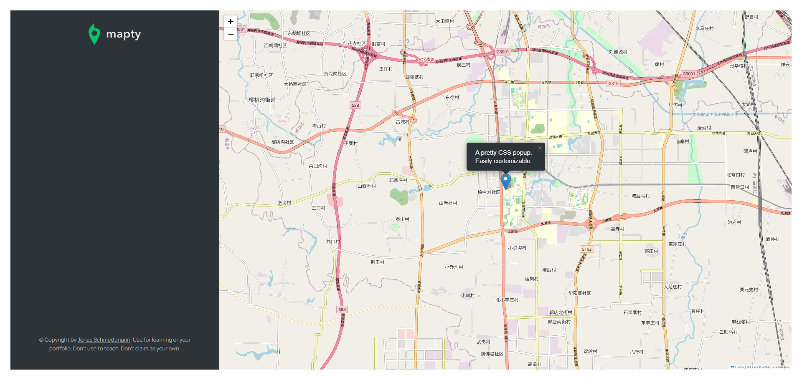

# Mapty Project

## Overview

This project is a web application that allows users to track their workouts on a map. It provides a user-friendly interface for adding new workouts, viewing existing workouts, and editing them. The application uses the Google Maps or Amap API to display the workouts on a map.

### Project Implementation Steps

#### Maps Part

**1.Using Geolocation API**

In javascript, we use `navigator.geolocation.getCurrentPosition()` method to get the user's current location.

```javascript
if (navigator.geolocation)
  navigator.geolocation.getCurrentPosition(
    function (position) {
      console.log(position);
      const { latitude, longitude } = position.coords; // destructuring user's location to latitude and longitude.
      console.log(`https://www.google.com/maps/@${latitude},${longitude},16z`);
      console.log(`https://www.amap.com/@${latitude},${longitude},16z`);
      /* according to the latitude andlongitude, we can get the map url. For global users, we can use Google Maps API; .For Chinese users, we can use Amap API. */
    },
    function () {
      alert('Could not get your position');
    },
  );
```

**2.Displaying a Map**

For displaying a map in our project, we can use leaflet.js which is a popular open-source JavaScript library for interactive maps. The usage of leaflet.js is billowing:

First of all, we need to import leaflet.js into our project.

```html
<link
  rel="stylesheet"
  href="https://unpkg.com/leaflet@1.9.4/dist/leaflet.css"
  integrity="sha256-p4NxAoJBhIIN+hmNHrzRCf9tD/miZyoHS5obTRR9BMY="
  crossorigin=""
/>
<script
  src="https://unpkg.com/leaflet@1.9.4/dist/leaflet.js"
  integrity="sha256-20nQCchB9co0qIjJZRGuk2/Z9VM+kNiyxNV1lvTlZBo="
  crossorigin=""
></script>
```

or using npm :

```bash
npm install leaflet
```

Then we can create a map object and add it to our HTML page.

```js
const map = L.map('map').setView([51.505, -0.09], 13); //use our location instead of [51.505, -0.09]

L.tileLayer('https://tile.openstreetmap.org/{z}/{x}/{y}.png', {
  attribution:
    '&copy; <a href="https://www.openstreetmap.org/copyright">OpenStreetMap</a> contributors',
}).addTo(map);

L.marker([51.5, -0.09])
  .addTo(map)
  .bindPopup('A pretty CSS popup.<br> Easily customizable.')
  .openPopup();
```

Now we can see a map in our HTML page.


**3.Adding Markers**
We want to add markers to our map to represent the locations of our workouts when users click on them. We can add a event `click` by `map.on()` and use the `L.marker()` method to add markers to our map.

```js
map.on('click', function (mapE) {
  console.log(mapE);
  const { lat, lng } = mapE.latlng;

  L.marker([lat, lng]).addTo(map).bindPopup('Content of the popup').openPopup();
});
```

Besides, we can learn more knowledge about other ui methods from [Leaflet.js](https://leafletjs.com/reference.html).


```js
map.on('click', function (mapE) {
  console.log(mapE);
  const { lat, lng } = mapE.latlng;

  L.marker([lat, lng])
    .addTo(map)
    .bindPopup(
      L.popup({
        maxWidth: 250, // max width of the popup
        minWidth: 100, // min width of the popup
        autoClose: false, // whether to close the popup when the map is clicked
        closeOnClick: false, // whether to close the popup when the popup is clicked
        className: 'running-popup', // change the class name of the popup
      }),
    )
    .setPopupContent('Workout') // set the content of the popup
    .openPopup();
});
```

Now we can see a marker when we click on the map.


**4.Rendering Input Form**
After we add markers to our map, we want to render an input form to let users add new workouts.Therefore, we can add a `event listener` by `map.on()` to listen to the click event on the map.

```js
map.on('click', function (mapE) {
  mapEvent = mapE;
  form.classList.remove('hidden');
  inputDistance.focus();
});
```

Then we can see an input form when we click on the map.However, now we can't display the input form on the map. We can use `L.popup()` to display the input form on the map and add `addEventListener` to check the `submit` event in the same time.

```js
form.addEventListener('submit', function (e) {
  e.preventDefault(); // (*)

  // Display marker
  console.log(mapEvent);
  const { lat, lng } = mapEvent.latlng;
  L.marker([lat, lng])
    .addTo(map)
    .bindPopup(
      L.popup({
        maxWidth: 250,
        minWidth: 100,
        autoClose: false,
        closeOnClick: false,
        className: 'running-popup',
      }),
    )
    .setPopupContent('Workout')
    .openPopup();
});
```

To prevent the page from refreshing by default when a form is submitted, we should use code `(*)`.

Finally, we want to hide the cadence and elevation input fields when the user selects cycling, and show them when the user selects running. We can use `addEventListener` to listen to the `change` event in the `inputType` element and toggle the `form__row--hidden` class to hide the input fields.

```js
inputType.addEventListener('change', function () {
  inputCadence.closest('.form__row').classList.toggle('form__row--hidden');
  inputElevation.closest('.form__row').classList.toggle('form__row--hidden');
});
```

#### Restructuring Classes


**1.Restructuring App Class**

```js
class App {
  #map;
  #mapEvent;
  constructor() {
    this._getPosition();

    form.addEventListener('submit', this._newWorkout.bind(this)); // (*)

    inputType.addEventListener('change', this._toggleElevationField.bind(this)); // (*)
  }
  _getPosition() {
    if (navigator.geolocation)
      navigator.geolocation.getCurrentPosition(
        this._loadMap.bind(this),
        function () {
          alert('Could not get your position');
        },
      );
  }

  _loadMap(position) {
    // console.log(position);
    const { latitude, longitude } = position.coords;

    const coords = [latitude, longitude];

    //
    this.#map = L.map('map').setView(coords, 14);

    L.tileLayer('https://{s}.tile.openstreetmap.fr/hot/{z}/{x}/{y}.png', {
      attribution:
        '&copy; <a href="https://www.openstreetmap.org/copyright">OpenStreetMap</a> contributors',
    }).addTo(this.#map);

    // Handling clicks on map
    this.#map.on('click', this._showForm.bind(this)); // (*)
    console.log(`https://www.google.com/maps/@${latitude},${longitude},16z`);
    console.log(`https://www.amap.com/@${latitude},${longitude},16z`);
  }

  _showForm(mapE) {
    this.#mapEvent = mapE;
    form.classList.remove('hidden');
    inputDistance.focus();
  }

  _toggleElevationField() {
    inputCadence.closest('.form__row').classList.toggle('form__row--hidden');
    inputElevation.closest('.form__row').classList.toggle('form__row--hidden');
  }
  _newWorkout(e) {
    e.preventDefault();

    // Clean input fields
    inputDistance.value =
      inputDuration.value =
      inputCadence.value =
      inputElevation.value =
        '';

    // Display marker
    const { lat, lng } = this.#mapEvent.latlng;
    L.marker([lat, lng])
      .addTo(this.#map)
      .bindPopup(
        L.popup({
          maxWidth: 250,
          minWidth: 100,
          autoClose: false,
          closeOnClick: false,
          className: 'running-popup',
        }),
      )
      .setPopupContent('Workout')
      .openPopup();
  }
}
```

> Remark:
> When we create a `EventListener`, we need to `bind` the `this` keyword to the `App` class `(*)`.

**2.Creating Workout Class**

```js
class Workout {
  date = new Date();
  id = Date.now().toString().slice(-10);
  constructor(coords, distance, duration) {
    this.coords = coords;
    this.distance = distance;
    this.duration = duration;
  }
}

class Running extends Workout {
  constructor(coords, distance, duration, cadence) {
    super(coords, distance, duration);
    this.cadence = cadence;
    this.calcPace();
  }
  // Pace: min/km
  calcPace() {
    const totalMins = +(this.duration / this.distance).toFixed(2);
    const min = Math.floor(totalMins);
    const sec = Math.floor((totalMins - min) * 60);

    this.pace = `${min} : ${sec}`; // such as 5:50.
    return this.pace;
  }
}

class Cycling extends Workout {
  constructor(coords, distance, duration, elevationGain) {
    super(coords, distance, duration);
    this.elevationGain = elevationGain;
    this.calcSpeed();
  }

  // Speed: km/h
  calcSpeed() {
    this.speed = +((this.distance / this.duration) * 60).toFixed(2);
    return this.speed;
  }
}
```
